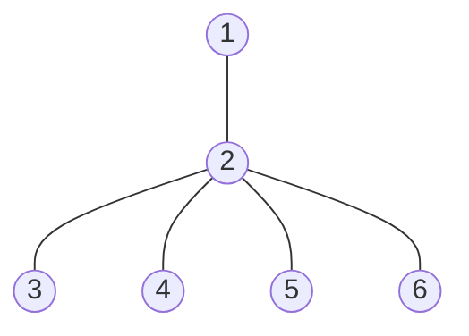

### Star Graph
#### A star graph is a graph where there is **one center node** and **exactly n - 1 edges** that connect the center node with every other node.

```mermaid 
graph TB;

1((1))
2((2))
3((3))
4((4))
5((5))
6((6))

1---2
2---3
2---4
2---5
2---6

```
