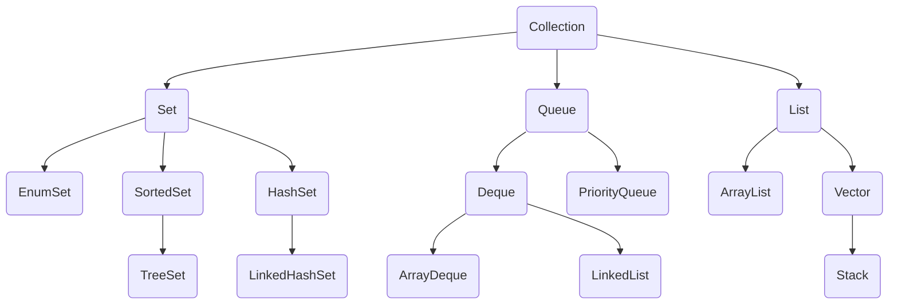

### 数据结构

```mermaid 
graph TB;

A(Collection)
B(Set)
C(Queue)
D(List)
E(EnumSet)
F(SortedSet)
G(HashSet)
H(Deque)
I(PriorityQueue)
J(ArrayList)
K(Vector)
L(TreeSet)
M(LinkedHashSet)
N(ArrayDeque)
O(LinkedList)
P(Stack)

A-->B;
A-->C;
A-->D;

B-->E;
B-->F;
F-->L;
B-->G;
G-->M;

C-->H;
H-->N;
H-->O;
C-->I;

D-->J;
D-->K;
K-->P;


```
