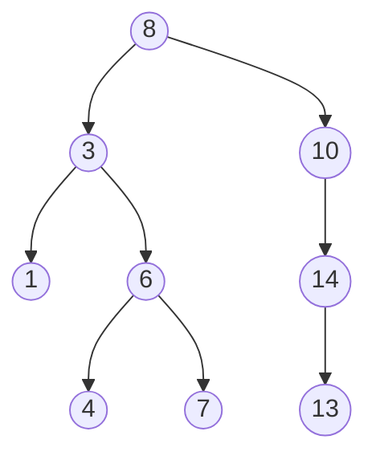

#### Binary Search Tree
##### In computer science, a binary search tree (BST), also called an ordered or sorted binary tree, is a rooted binary tree data structure with the key of each internal node being greater than all the keys in the respective node's left subtree and less than the ones in its right subtree. 
##### The time complexity of operations on the binary search tree is linear with respect to the height of the tree.

