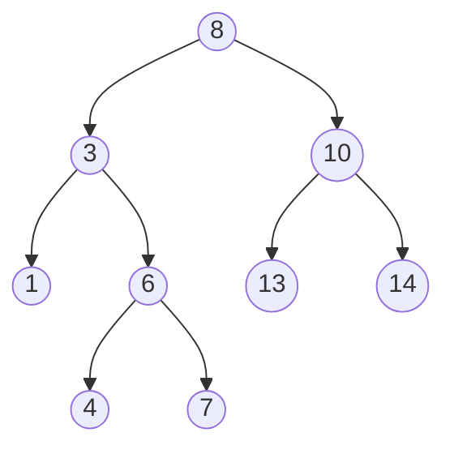

### Balanced Binary Search Tree
#### A binary search tree is balanced if the depth of the two subtrees of every node never differs by more than 1.

```mermaid 
graph TB;

1((1))
3((3))
4((4))
6((6))
7((7))
8((8))
10((10))
13((13))
14((14))

8-->3
8-->10
3-->1
3-->6
10-->13
10-->14
6-->4
6-->7

```
