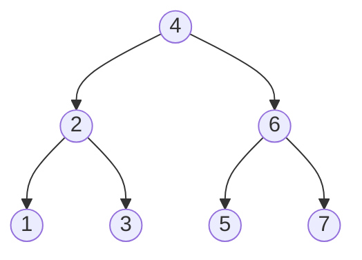

### Depth First Search
### 深度优先搜索

- 前序 (preorder): 中 -> 左 -> 右，4213657
- 中序 (inorder): 左 -> 中 -> 右，1234567。注意：对于 (binary search tree, BST) 做 inorder traversal 就是由小到大依序遍历。
- 后序 (postorder): 左 -> 右 -> 中，1325764

